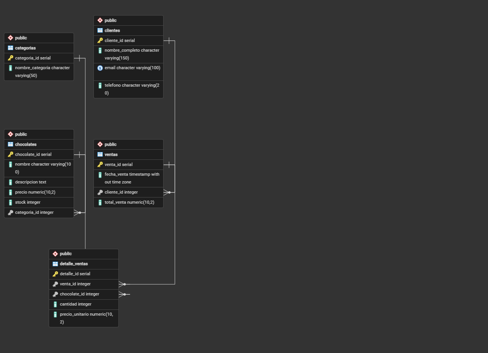

# Sistema-de-Ventas-de-Chocolates-
Base de datos relacional para la gestión de inventario y ventas de una chocolatería, desarrollada en PostgreSQL

# 🍫 Sistema de Gestión "ChocoAdmin" - Proyecto Formativo

## 📝 1. Introducción al Proyecto
Este proyecto consiste en el diseño, implementación y documentación de una base de datos relacional para una chocolatería artesanal. El objetivo es centralizar la información de productos, clientes y transacciones para optimizar la toma de decisiones y el control de inventario.

---

##  2. Herramientas Utilizadas

### PostgreSQL
Es el sistema de gestión de bases de datos (DBMS) relacional de código abierto más avanzado del mundo. En este proyecto, PostgreSQL actúa como el motor que procesa todas las consultas, almacena los datos de forma segura y garantiza la integridad referencial mediante llaves primarias y foráneas.

### pgAdmin 4
Es la herramienta de administración gráfica líder para PostgreSQL. Facilita la gestión de la base de datos sin necesidad de usar exclusivamente la línea de comandos. En este proyecto se utilizó para:
* **Query Tool:** Escritura y ejecución de scripts SQL (DDL y DML).
* **ERD Tool:** Generación visual del modelo Entidad-Relación.
* **Backup/Restore:** Gestión de respaldos y portabilidad de datos.

---

##  3. Modelo Entidad-Relación (ERD)
El diseño lógico es el corazón del proyecto. Se ha estructurado bajo una arquitectura de normalización para evitar la redundancia de datos.



### Explicación del Esquema:
1.  **Categorías:** Clasifica los chocolates (Amargos, Blancos, etc.).
2.  **Chocolates:** Almacena el catálogo con precios (`Numeric`) para precisión monetaria y stock (`Integer`).
3.  **Clientes:** Registro de datos de contacto únicos.
4.  **Ventas:** Cabecera que registra el total de la compra y la fecha.
5.  **Detalle de Ventas:** Tabla intermedia que permite que una sola venta contenga múltiples tipos de chocolates.

---

##  4. Componentes del Proyecto Formativo
Para que este proyecto sea considerado de nivel profesional, incluye:

1.  **Script de Estructura (DDL):** Definición de tablas con sus tipos de datos correctos (`SERIAL`, `VARCHAR`, `TIMESTAMP`).
2.  **Script de Datos (DML):** Inserción de al menos 5 registros por tabla para pruebas de funcionalidad.
3.  **Integridad de Datos:** Uso de `Constraints` (PRIMARY KEY, FOREIGN KEY, UNIQUE) para asegurar que la información sea consistente.
4.  **Documentación (README):** Explicación clara de cómo replicar el sistema.
5.  **Backup SQL:** Un archivo ejecutable que permite restaurar el proyecto completo en cualquier servidor local.

---

##  5. Instrucciones de Ejecución
Siga estos pasos para replicar el ambiente en su equipo local:

1.  **Descarga:** Descargue el archivo `respaldo_chocolateria.sql` de este repositorio.
2.  **Creación de BD:** En pgAdmin 4, cree una base de datos vacía llamada `venta_chocolates`.
3.  **Importación:**
    * Haga clic derecho en la base de datos y abra el **Query Tool**.
    * Pegue el contenido del archivo `.sql`.
    * Presione **F5** para ejecutar.
4.  **Verificación:** Ejecute `SELECT * FROM chocolates;` para comprobar que los datos de prueba se cargaron correctamente.

---

##  6. Conclusiones
El uso de PostgreSQL y pgAdmin permite escalar este sistema desde una pequeña tienda local hasta una franquicia nacional. La correcta implementación del modelo relacional garantiza que el sistema sea fácil de mantener y que la información de ventas sea siempre precisa.

## 🔍 7. Consultas de Gestión 

Para demostrar la utilidad del sistema, se han diseñado consultas SQL avanzadas que permiten extraer métricas clave del negocio directamente desde pgAdmin:

### A. Reporte de Inventario por Categoría
Esta consulta permite saber cuántos productos tenemos y cuál es el valor de nuestro inventario actual agrupado por tipo de chocolate.
```sql
SELECT 
    cat.nombre_categoria AS Categoria,
    COUNT(c.chocolate_id) AS Total_Productos,
    SUM(c.stock) AS Unidades_Disponibles,
    SUM(c.stock * c.precio) AS Valor_Inventario_Total
FROM chocolates c
JOIN categorias cat ON c.categoria_id = cat.categoria_id
GROUP BY cat.nombre_categoria
ORDER BY Valor_Inventario_Total DESC;
